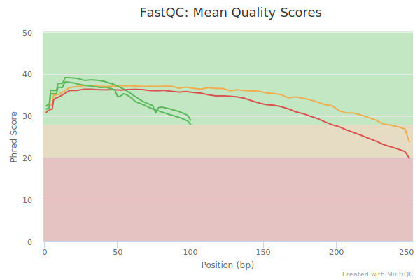
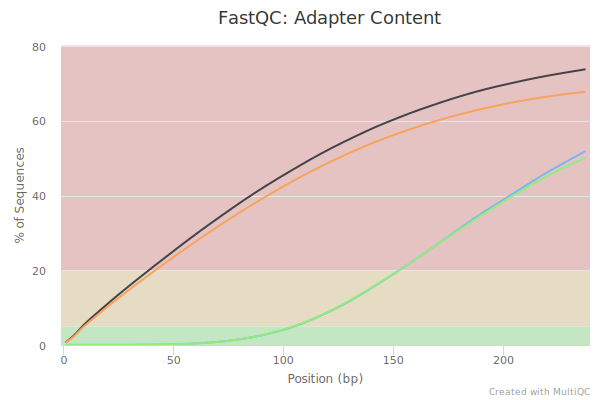
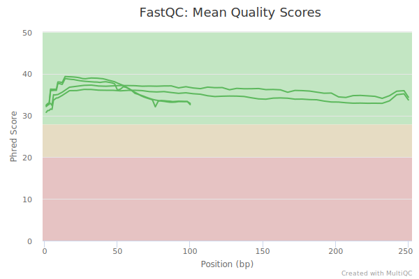
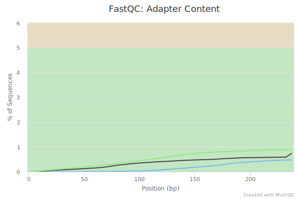
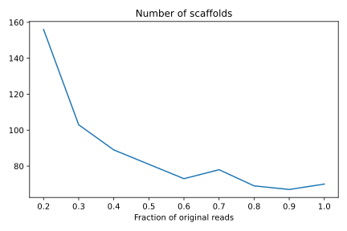
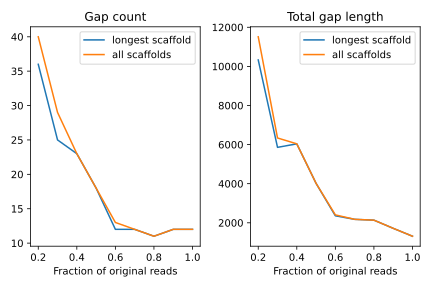

# hse21_hw1

```bash
mkdir hw1
ln -s /usr/share/data-minor-bioinf/assembly/  hw1/
cd hw1
mkdir data
```

#### Выбор случайного набора чтений.
```bash
seqtk sample -s1705 assembly/oil_R1.fastq 5000000 > data/R1_sample.fastq
seqtk sample -s1705 assembly/oil_R2.fastq 5000000 > data/R2_sample.fastq
seqtk sample -s1705 assembly/oilMP_S4_L001_R1_001.fastq 1500000 > data/R1_MP_sample.fastq
seqtk sample -s1705 assembly/oilMP_S4_L001_R2_001.fastq 1500000 > data/R2_MP_sample.fastq
```

#### Оценка качества
```bash
mkdir {fast,multi}qc
fastqc -o fastqc/ data/*
multiqc ./fastqc/ -o multiqc/
```




Заметно, что ближе к концу сильно падает качество чтений и возрастает содержание адаптеров

#### Обрезка чтений
```bash
platanus_trim data/R?_sample.fastq
platanus_internal_trim data/R?_MP_sample.fastq
rm data/*.fastq
```

#### Оценка качества
```bash
mkdir {fast,multi}qc_trimmer
fastqc -o fastqc_trimmed/ data/*
multiqc ./fastqc_trimmed/ -o multiqc_trimmed/
```




Среднее качество увеличилось, адаптеров почти не осталось.

#### Сборка/анализ контигов и скаффолдов
```bash
platanus assemble -f data/R?_sample.fastq.trimmed
platanus scaffold -c out_contig.fa -IP1 data/R{1,2}_sample.fastq.trimmed -OP2 data/R{1,2}_MP_sample.fastq.int_trimmed
rm *.tsv *Bubble.fa
```

Анализ полученных последовательностей ([код](./src/hw1.ipynb)):

```
Stats for data/contigs.fasta
 - Number of records: 607
 - Total length: 3924917
 - Longest record: 179307
 - N50: 53980

Stats for data/scaffolds_noClose.fasta
 - Number of records: 70
 - Total length: 3873759
 - Longest record: 3831941
 - N50: 3831941
```

#### Уменьшение числа гэпов

```bash
platanus gap_close -c out_scaffold.fa -IP1 data/R{1,2}_sample.fastq.trimmed -OP2 data/R{1,2}_MP_sample.fastq.int_trimmed
rm -r data/
```

Статистика по гэпам ([код](./src/hw1.ipynb)):

```
Gap stats for the longest scaffold
 - Gap count: 63
 - Total gap length: 5979

Gap stats for the longest scaffold (with closed gaps)
 - Gap count: 12
 - Total gap length: 1312
```

#### Результаты сборки
* [Контиги](./data/contigs.fasta)
* [Скаффолды (до уменьшения гэпов)](./data/scaffolds_noClose.fasta)
* [Скаффолды](./data/scaffolds.fasta)
*  [Самый длинный скаффолд](./data/longest.fasta)
*  [Самый длинный скаффолд (до уменьшения гэпов)](./data/longest_noClose.fasta)

## Необязательная часть

Для сборки использовался скрипт [`assemble.sh`](./src/assemble.sh)

```bash
for frac in 0.{9..1}; do
    THREADS=2 ./assemble.sh $frac
done
rm -r data
rm assemble_*.log
```




Для 10% чтений результаты оказались значительно (в 3-5 раз) хуже, поэтому они не включены в графики.
